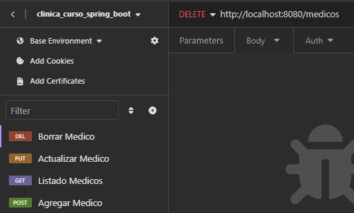

## Clinica
## Spring Boot 3 => spring-boot-3- aplique practicas proteja api rest
## Instructor: Diego Rojas
## Alura Latam

| Clase | Pasos                                    | Errores/Observación |
|-------|------------------------------------------|---------------------|
|       | Iniciando rama para esta parte del curso |                     |


### CORS
    @Configuration
    public class CorsConfiguration implements WebMvcConfigurer {
    
        @Override
        public void addCorsMappings(CorsRegistry registry) {
            registry.addMapping("/**")
                .allowedOrigins("http://localhost:3000")
                .allowedMethods("GET", "POST", "PUT", "DELETE", "OPTIONS", "HEAD", "TRACE", "CONNECT");
        }
    }

### Json enviado en pruebas con insomia:
    
    {
        "nombre":"luis",
        "email":"sanchez@gmail.com",
        "documento":"1114277",
        "especialidad":"ODONTOLOGIA",
        "direccion":
            {
            "calle":"pppal",
            "distrito":"distrito 1",
            "ciudad":"bucaramanga",
            "numero":"20",
            "complemento":"cerca de aqui"
            }
    }
    

### Dependencias agregadas: mysql + jpa + flyway migration

    <dependency>
      <groupId>org.springframework.boot</groupId>
      <artifactId>spring-boot-starter-data-jpa</artifactId>
    </dependency>

    <dependency>
      <groupId>org.flywaydb</groupId>
      <artifactId>flyway-core</artifactId>
    </dependency>

    <dependency>
      <groupId>org.flywaydb</groupId>
      <artifactId>flyway-mysql</artifactId>
    </dependency>

    <dependency>
      <groupId>com.mysql</groupId>
      <artifactId>mysql-connector-j</artifactId>
      <scope>runtime</scope>
    </dependency>

### Codigo SQL para crear la tabla medicos.

```sql
DROP TABLE IF EXISTS medicos;
CREATE TABLE medicos (
    id BIGINT NOT NULL AUTO_INCREMENT PRIMARY KEY,
    nombre VARCHAR(100) NOT NULL,
    email VARCHAR(100) NOT NULL UNIQUE,
    documento VARCHAR(10) NOT NULL UNIQUE,
    especialidad VARCHAR(100) NOT NULL,
    calle VARCHAR(100) NOT NULL,
    distrito VARCHAR(100) NOT NULL,
    complemento VARCHAR(100),
    numero VARCHAR(20),
    ciudad VARCHAR(100) NOT NULL
);
````

### Dependencia del paquete **validation**

    <dependency>
      <groupId>org.springframework.boot</groupId>
      <artifactId>spring-boot-starter-validation</artifactId>
    </dependency>

### Codigo para agregar el telofono en mysql

```sql
    ALTER TABLE medicos ADD telefono VARCHAR(20) NOT NULL;
````

### Nuevo Json ahora con el telefono, para agregar dato payload metodo POST

    {
        "nombre":"luis lolo",
        "email":"sanchez4@gmail.com",
        "documento":"11142155",
        "telefono":"123456",
        "especialidad":"PEDIATRIA",
        "direccion":
        {
            "calle":"pppal",
            "distrito":"distrito 1",
            "ciudad":"bucaramanga",
            "numero":"20",
            "complemento":"cerca de aqui"
        }
    }

### Payload para actualizar un medico. en insomia, metodo PUT, actualizar solo el nombre

    {
			"id": 1,
			"nombre": "nombre 11"
    }

### Insomia con sus casos creados:


