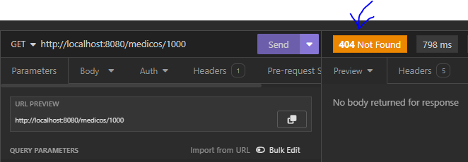
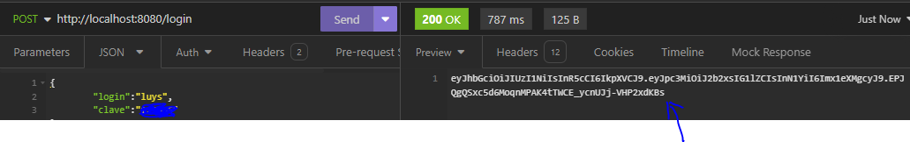

## APP Clinica
## Spring Boot 3 => spring-boot-3- aplique practicas proteja api rest
## Instructor: Diego Rojas
## Alura Latam

| Clase | Pasos                                                                                                                                 | Errores/Observación                                               |
|-------|---------------------------------------------------------------------------------------------------------------------------------------|-------------------------------------------------------------------|
|       | Iniciando rama para esta parte del curso                                                                                              |                                                                   |
|       |                                                                                                                                       |                                                                   |
| 01-03 | Estandarizando retornos de API                                                                                                        |                                                                   |
|       | Es necesario enviar respuestas mas claras al cliente                                                                                  |                                                                   |
|       | con codigos personalizados ejem: 201 y no solo 200                                                                                    |                                                                   |
|       | en el metodo eliminarMedico() que es public void                                                                                      |                                                                   |
|       |                                                                                                                                       |                                                                   |
|       | **PARA DELETE**                                                                                                                       |                                                                   |
|       | se debe cambiar por ResponseEntity para que spring ayude a retornar                                                                   |                                                                   |
|       | el valor especifico, ahora obliga al metodo a responder                                                                               | ahora tenemos esta respuesta:                                     |
|       | para este caso return ResponseEntity.noContent().build();                                                                             |                                        |
|       |                                                                                                                                       |                                                                   |
|       | **PARA UPDATE**                                                                                                                       |                                                                   |
|       | igual se agrega al metodo la respuesta ResponseEntity, pero tambien                                                                   | ahora da respuesta 200 ok + info                                  |
|       | es necesario agregar un nuevo DTO que solo devuelva los datos necesarios                                                              |                                        |
|       |                                                                                                                                       |                                                                   |
| 01-04 | Devolviendo el codigo 201                                                                                                             |                                                                   |
|       | **PARA POST**  agregar medico                                                                                                         |                                                                   |
|       | API REST es un standar, y pide indiferentemente del lenguaje                                                                          |                                                                   |
|       | para el caso de POST:                                                                                                                 |                                                                   |
|       | 1. retornar  201+ created                                                                                                             |                                                                   |
|       | 2. la url donde esta el nuevo recurso guardado  id = xx                                                                               |                                                                   |
|       | - ejem: GET: http://localhost:8080/medico/xx   se deberia ver el medico                                                               |                                                                   |
|       | ---                                                                                                                                   |                                                                   |
|       | se cambia void por ResponseEntity                                                                                                     |                                                                   |
|       | se agrega la variable: Medico medico = medicoRepository.save(new Medico(datosRegistroMedico));                                        |                                                                   |
|       | se re utiliza el dto de datosRespuestaMedico() para retornar esos datos y no la entidad                                               |                                                                   |
|       | como es necesario retornar una URL entonces se usa en la clase un helper de spring para eso:                                          | nuevo id agregado:                                                |
|       | UriComponentsBuilder en los parametros                                                                                                |                                        |
|       | URI url = uriComponentsBuilder.path("/medicos/{id}").buildAndExpand(medico.getId()).toUri();                                          | en el header devuelve la url:                                     |
|       |                                                                                                                                       |                                        |
| 01-05 | Detallando los datos de API                                                                                                           |                                                                   |
|       | Un error 405 dice que el metodo no esta habilitado o implementado, en nuestro caso existe                                             | esto daba error  de proxy. buscando con la ia                     |
|       | el metodo get para el listado de medicos, pero no para un medico en especifico                                                        | me dice que falta: @Transactional(readOnly = true)                |
|       | su usa ahora un wrapper o envoltorio para el getmappin del listado de medicos                                                         | en el metodo. agregado y ahora si funciona.                       |
|       |                                                                                                                                       |                                                                   |
| 02-02 | Tratando los errores de API                                                                                                           |                                                                   |
|       | Por ejemplo el error 500 devuelve mucha informacion en el "tracer", info sensible                                                     |                                                                   |
|       | lo cual son brechas de seguridad que puede ser usadas por hackers                                                                     |                                                                   |
|       | se debe configurar el application.properties                                                                                          |                                                                   |
|       | se busca en google: spring boot properties                                                                                            |                                                                   |
|       | https://docs.spring.io/spring-boot/appendix/application-properties/index.html                                                         |                                        |
|       | en el aprtado: server properties (a la derecha)                                                                                       |                                                                   |
|       | server.error.include-stacktrace=never                                                                                                 |                                                                   |
|       |                                                                                                                                       |                                                                   |
| 02-03 | Tratando el error 404 #1                                                                                                              |                                                                   |
|       | la excepcion cuando se busca un medico que no existe es: EntityNotFoundException                                                      |                                                                   |
|       | y deberia devolver el erro 404 que es no encontrado y no error 500 que es de servidor                                                 |                                                                   |
|       | para tratar la excepcion se puede usar try-catch, pero spring ya trae un opcion                                                       |                                                                   |
|       | 1. se crea nuevo paquete - infra                                                                                                      |                                                                   |
|       | 2. se crea nueva clase TratadorDeErrores.java  para tratar los errores de manera global                                               |                                                                   |
|       |                                                                                                                                       |                                                                   |
| 02-04 | Tratando el error 404 #2                                                                                                              |                                                                   |
|       | se crea el metodo en la clase tratadorDeErrores, con la anotacion:  @RestControllerAdvice                                             |                                        |
|       | @ExceptionHandler y la excepcion: EntityNotFoundException.class                                                                       |                                                                   |
|       | se retorna respuesta con: ResponseEntity.notFound().build()                                                                           |                                                                   |
|       |                                                                                                                                       |                                                                   |
| 02-05 | Tratando el error 400                                                                                                                 |                                                                   |
|       | por ejemplo si el payload esta mal, por ejemplo faltan datos se da un error de bad request                                            | por ejemplo aqui se intenta agregar un medico sin nombre y correo |
|       | la idea es dar una respuesta amigable ya que la respuesta de la api es compleja:                                                      |                                        |
|       | se agrega un nuevo metodo para manejar ese error 400 en la clase tratadorDeErrores                                                    |                                                                   |
|       | la excepcion se consigue en el log: MethodArgumentNotValidException                                                                   | ahora retorna sin datos el error:                                 |
|       | y se retorna respuesta con: ResponseEntity.badRequest().build()                                                                       |                                        |
|       | retornando solo que el payload es incorrecto sin decir en donde.                                                                      |                                                                   |
|       |                                                                                                                                       |                                                                   |
|       | se agrega (MethodArgumentNotValidException e) al metodo tratarError400() debe ser la misma excepcion                                  |                                                                   |
|       | se crea una variable que tendrá los errores: var errores = e.getAllErrors()                                                           |                                                                   |
|       | se retorna: ResponseEntity.badRequest().body(errores);                                                                                | sigue saliendo una lista extensa del detalle del error            |
|       | -- como se quiere personalizar el error, se usa ahora un DTO en la misma clase                                                        |                                                                   |
|       | se usa stream().map() se debe agregar el constructor al DTO                                                                           |                                        |
|       |                                                                                                                                       |                                                                   |
| 03-02 | Autenticación y autorización  usando **spring security**                                                                              |                                      |
|       | ¿Qué significa stateless? Que no tiene estado, no tiene estado significa que el servidor no conoce qué usuarios están logueados o no, |                                      |
|       | a diferencia del approach que toma, por ejemplo Java Server Faces, que por cada usuario te crea una sesión de usuario.                |                                      |
|       | 1. autenticacion  - ejemplo mi pasaporte para viajar                                                                                  |                                                                   |
|       | 2. autorizacion   - ejemplo mi visa si deseo ingresar a eeuu                                                                          |                                                                   |
|       |                                                                                                                                       |                                                                   |
| 03-04 | Agregando Spring Security                                                                                                             |                                                                   |
|       | se agrega al pom.xml la nueva dependencia tomada de https://start.spring.io/                                                          |                                                                   |
|       | al arrancar genera de manera automatica una clave de desarrollo el usuario por defecto es **user**                                    |                                                                   |
|       | que impide consultar la api sin autorizacion dando un **error 401 unauthorized**                                                      |                                                                   |
|       | por defecto todos los request necesitan autorizacion y estan bloqueados                                                               |                                                                   |
|       | y se crea de manera automatica un login:                                                                                              |                                      |
|       |                                                                                                                                       |                                                                   |
| 03-05 | Las entidades usuario y migration                                                                                                     |                                                                   |
|       | se requieren pasos para configurar. se necesita el bd los usuarios y claves                                                           |                                                                   |
|       | 1. se crea nuevo paquete usuarios                                                                                                     |                                                                   |
|       | 2. se crea la clase Usuarios                                                                                                          |                                                                   |
|       | 3. se agregan las anotaciones y se define la tabla y la entidad para configurar todo con JPA                                          |                                                                   |
|       | 4. luego se hace la migracion en la bd  V4__create-table-usuarios.sql                                                                 |                                                                   |
|       | -- para clave se define un dato encriptado con hashing de 300 caracteres                                                              |                                                                   |
|       | -- se ejecuta la migracion                                                                                                            |                                                |
|       |                                                                                                                                       |                                            |
| 03-06 | Repository Service                                                                                                                    |                                                                   |
|       | la encriptacion a usar en spring security sera: BCrypt                                                                                |                                                                   |
|       | siguiendo los pasos de la clase anterior:                                                                                             |                                                                   |
|       | 5. se debe crear el repositorio  que es una interfaz, que extienda de JpaRepository<Usuario, Long>                                    |                                                                   |
|       | 6. se crea el servicio de autenticacion de usuarios, para mejorar las carpetas de crean 2 paquetes, errores y security                |                                                                   |
|       | -- AutenticacionService.java                                                                                                          |                                                                   |
|       | -- marcar con @Service                                                                                                                |                                                                   |
|       | -- se debe implementar la interface por spring para validar usuarios: UserDetailsService                                              |                                                                   |
|       | -- se implementan los metodos con intellij                                                                                            |                                                                   |
|       | -- se debe crear el metodo en el repositorio                                                                                          |                                                                   |
|       | 7. se crea el metodo UserDetails findByUsername(String username);                                                                     |                                                                   |
|       |                                                                                                                                       |                                                                   |
| 03-08 | Configuración de seguridad #1                                                                                                         |                                                                   |
| 03-09 | se crea una nueva clase en el paquete security. SecurityConfigurations, marcada con @Configuration y @EnableWebSecurity               |                                                                   |
|       | en la compilacion spring primero revisa los anotados con @Configuration para saber que debe configurar primero                        |                                                                   |
|       | se crea el metodo SecurityFilterChain                                                                                                 |                                                                   |
|       | habia un error en el repository: era **findByLogin y no findByUsername**                                                              |                                                                   |
|       | ya se habilitan los endpoints pero otra vez quedan disponibles y vulnerables. no se pide ni usuario ni clave                          |                                                                   |
|       |                                                                                                                                       |                                                                   |
| 03-12 | Controller de autenticación                                                                                                           |                                                                   |
|       | se crea en insomia en login de usuario, el payload se adjunta                                                                         |                                                                   |
|       | se crea el autenticationController                                                                                                    |                                                                   |
|       | se crea el dto, DatosAutenticacionUsuario tipo record                                                                                 |                                                                   |
|       | se usa de spring boot AuthenticationManager                                                                                           |                                                                   |
|       |                                                                                                                                       |                                                                   |
| 03-13 | Retornando usuarios mysql #1                                                                                                          |                                                                   |
|       | se usa https://www.browserling.com/tools/bcrypt                                                                                       |                                                                   |
|       | para por ejemplo encriptar la clave ya que debe ser guardadada encriptada                                                             |                                                                   |
|       | por ejemplo para 123456                                                                                                               |                                                                   |
|       | es: $2a$10$poRIRQcgbOPAMsLEJCXatedNg6TTvRqJAGOPMebMkfDF3cpcub8ym                                                                      |                                                                   |
|       | * Spring Boot necesita saber en la clase Usuario quien es el nombre, quien la clave y que                                             |                                                                   |
|       | * algoritmo será usado para la encriptacion. en securityconfiguration                                                                 |                                                                   |
|       | al Usuario es necesario implementar la interface UserDetails                                                                          |                                                                   |
|       | aun no logea... da error 403 Forbidden                                                                                                |                                                                   |
|       |                                                                                                                                       |                                                                   |
| 03-14 | Retornando usuarios mysql #2                                                                                                          |                                            |
|       | faltaba en autenticationcontroller agregar el @RequestBody y el @Valid en su metodo                                                   | usuario incorrecto entonces acceso denegado                       |
|       | autenticarUsuario. ya valida bien                                                                                                     |                                            |
|       |                                                                                                                                       |                                                                   |
| 04-02 | Agregando la libreria auth0-jwt                                                                                                       |                                                                   |
|       | se usa JWT, https://jwt.io/  estandar para definicion de tokens                                                                       |                                                                   |
|       | nos lleva a : https://github.com/auth0                                                                                                |                                                                   |
|       | https://github.com/auth0/java-jwt                                                                                                     |                                                                   |
|       | se agrega la dependencia al pom.xml                                                                                                   |                                                                   |
|       |                                                                                                                                       |                                                                   |
| 04-03 | Generando un jwt                                                                                                                      |                                                                   |
|       | se crea en security una clase TokenService con su anotacion @Service                                                                  |                                                                   |
|       | se usa el codigo de ejemplo de github                                                                                                 |                                                                   |
|       | se cambia el algoritmo por: Algorithm.HMAC256() que pide el string para validar tambien llamada **secret**                            |                                            |
|       | se valida el token generado en el sitio web de jwt                                                                                    |                                            |
|       |                                                                                                                                       |                                                                   |
| 04-04 | Ajustes de generación en jwt                                                                                                          |                                                                   |
|       | es necesario que los tokens sean dinamicos                                                                                            |                                                                   |
|       | se agrega parametro en el metodo: generarToken()                                                                                      |                                                                   |
|       | se le agrega el id                                                                                                                    |                                                                   |
|       | se le agrega tiempo de expiracion del token                                                                                           |                                            |
|       | ahora al front es necesario enviar es un dto, no un string con el token                                                               |                                                                   |
|       | se crea el record DatosJWTtoken dt, ahora la respuesta es en formato json                                                             |                                                                   |
|       | el **secret** puede ser agregado en applications.properties                                                                           |                                                                   |
|       | api.security.secret=xxxxxx  , pero por seguridad se deben usar variables de entorno                                                   |                                                                   |
|       | api.security.secret=${JWT_SECRET}                                                                                                     |                                                                   |
|       | y se llama en la clase: @Value("${api.security.secret}")                                                                              |                                                                   |
|       | se puede usar un valor por defecto: api.security.secret=${JWT_SECRET:123456}                                                          |                                                                   |
|       |                                                                                                                                       |                                                                   |
| 05-02 | Interceptando el Requests                                                                                                             |                                                                   |
|       | los recursos estan disponibles, es necesario bloquearlos y habilitarlos solo con el token valido                                      |                                                                   |
|       | pasamos de la autenticacion a la autorizacion                                                                                         |                                            |
|       | una opcion seria validar el token en cada metodo, pero eso no es escalable                                                            |                                                                   |
|       | utilizando la imegen adjunta se opta por utilizar filtros ya que mvc de spring permite                                                |                                                                   |
|       | validar filtros antes de llegar al controlador                                                                                        |                                                                   |
|       |                                                                                                                                       |                                                                   |

### Objetivos:

### Payload para actualizar un medico. en insomia, metodo PUT, actualizar solo el nombre

    {
			"id": 1,
			"nombre": "nombre 11"
    }

### Dependencia para spring security

    <dependency>
      <groupId>org.springframework.boot</groupId>
      <artifactId>spring-boot-starter-security</artifactId>
    </dependency>

### Payload para login

    {
        "login":"luys",
        "clave":"******"
    }

### Dependencia para JWT Auth

    <dependency>
      <groupId>com.auth0</groupId>
      <artifactId>java-jwt</artifactId>
      <version>4.4.0</version>
    </dependency>

### Codigo de ejemplo de Auth0

    try {
        Algorithm algorithm = Algorithm.RSA256(rsaPublicKey, rsaPrivateKey);
        String token = JWT.create()
        .withIssuer("auth0")
        .sign(algorithm);
    } catch (JWTCreationException exception){
        // Invalid Signing configuration / Couldn't convert Claims.
    }