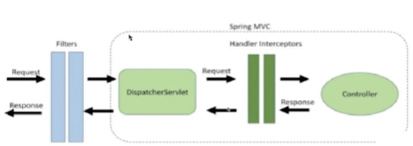

## Clinica
## Spring Boot 3
## Instructor: Diego Rojas
## Alura Latam

| Clase | Pasos                                                                                | Errores/Observación                         |
|-------|--------------------------------------------------------------------------------------|---------------------------------------------|
| 01-01 | Creando proyecto con Spring Boot 3                                                   |                                             |
|       | se ingresa a https://start.spring.io/                                                |                                             |
|       | se configura y se agregan 3 dependencias                                             |                                             |
|       | 1. Spring Boot Dev Tools 2. Lombok  3. Spring Web                            |                                             |
|       |                                                                                      |                                             |
| 01-06 | Estructura proyecto                                                                  |                          |
|       | se verifican las dependencias en maven                                               |                                             |
|       | se verifica la estructura del proyecto                                               |                      |
|       |                                                                                      |                                             |
| 01-07 | Hello World                                                                          |                                             |
|       | se crea el paquete controller luego la clase HelloController                         |                                             |
|       | se le coloca la anotacion al controlador: @RestController                            |                                             |
|       | se agrega la anotacion en el controlador @RequestMapping("/hello")                   |                      |
|       | se crea el metodo helloWorld(), con su @GetMapping                                   |                                             |
|       |                                                                                      |                                             |
| 02-02 | Enviando datos                                                                       |                      |
|       | se debe descargar insomia, para pruebas de api                                       |                                             |
|       | https://insomnia.rest/download                                                       |                                             |
|       | se crea el nuevo http request                                                        |                      |
|       | se verifica conexion con spring, y el endpoint                                       |                      |
|       | se puede enviar un datos json y ver que da error pero si establece la conexión       |                                             |
|       |                                                                                      |                                             |
| 02-03 | Recibiendo datos                                                                     |                                             |
|       | se crea MedicoController                                                             |                                             |
|       | se le coloca @RestController                                                         |                                             |
|       | se agrega el requestmapping  @RequestMapping("/medicos")                             |                                             |
|       | se crea el metodo registrarMedico, como recibe datos entonces se agrega su:          |                      |
|       | @PostMapping                                                                         |                                             |
|       | los datos que se envian son el @RequestBody                                          |                      |
|       |                                                                                      |                                             |
| 02-05 | CORS                                                                                 |                                             |
|       | se crea el paquete de configuration                                                  |                                             |
|       | se agrega la clase corsconfiguration                                                 |                                             |
|       | se agrega el codigo, CORS                                                            |                                             |
|       |                                                                                      |                                             |
| 02-06 | DTO Java Record #1                                                                   |                                             |
|       | se crea un record para mapear los parametros que se reciben de los datos del medico  |                                             |
|       | en el nuevo paquete model, el tipo record DatosRegistroMedico                        |                                             |
|       | se crea la clase enum especialidad, con 4 especialidades                             |                      |
|       | se crea la clase record datosDireccion,                                              | muestra ok, solo envio datos, sin direccion |
|       |                                                                                      |                                             |
| 02-07 | DTO Java Record #2                                                                   |                      |
|       | se revisa el formato del dto y del json que se envia, todo ok                        |                                             |
|       | revision de las validaciones                                                         |                    |
|       | https://docs.oracle.com/en/java/javase/16/language/records.html                      |                                             |
|       |                                                                                      |                                             |
| 03-03 | Agregando dependencias                                                               |                                             |
|       | - agregar dependencia con spring initializr  ojo seleccionar **maven**               |                    |
|       | - spring data jpa + mysql driver + flyway migration                                  |                                             |
|       | - se va a explorer y se busca el codigo de la dependencia y se agrega al proyecto    |                                             |
|       |                                                                                      |                                             |
|       | luego es necesario configurar el application.properties                              |                                             |
|       | con:                                                                                 |                                             |
|       | - spring.datasource.driver-class-name=com.mysql.cj.jdbc.Driver                       |                                             |
|       | - spring.datasource.url=jdbc:mysql://host/bd_name                                    |                                             |
|       | - spring.datasource.username=user_name                                               |                                             |
|       | - spring.datasource.password=pass_word                                               |                                             |
|       |                                                                                      |                                             |
|       | voy a usar la bd de mysql de: https://www.freesqldatabase.com/                       |                                             |
|       |                                                                                      |                                             |
| 03-05 | Entidades JPA                                                                        |                                             |
|       | se crea la clase Medico, para la persistencia de datos                               |                                             |
|       | se le agrega el @Table(name="medico")                                                |                                             |
|       | @Entity(name = "Medico"), @Id , @GeneratedValue(strategy = GenerationType.IDENTITY)  |                                             |
|       | @Enumerated(EnumType.STRING) en especialidad                                         |                                             |
|       | @Embedded en direccion                                                               |                                             |
|       | y @Embeddable en Direccion                                                           |                                             |
|       |                                                                                      |                                             |
|       | **lombok**  en Medico                                                                |                                             |
|       | con anotaciones puedo pedir que cree todo lo necesario como los setter y getters etc |                                             |
|       | @Getter,  @NoArgsConstructor, @AllArgsConstructor, @EqualsAndHashCode(of = "id")     |                                             |
|       |                                                                                      |                                             |
|       | luego para Direccion, con lombok:                                                    |                                             |
|       | @Getter, @NoArgsConstructor, @AllArgsConstructor                                     |                                             |
|       |                                                                                      |                                             |
|       | vamos a medicocontroller.                                                            |                                             |
|       |                                                                                      |                                             |
|       |                                                                                      |                                             |
|       |                                                                                      |                                             |
|       |                                                                                      |                                             |

### CORS
    @Configuration
    public class CorsConfiguration implements WebMvcConfigurer {
    
        @Override
        public void addCorsMappings(CorsRegistry registry) {
            registry.addMapping("/**")
                .allowedOrigins("http://localhost:3000")
                .allowedMethods("GET", "POST", "PUT", "DELETE", "OPTIONS", "HEAD", "TRACE", "CONNECT");
        }
    }

### Json enviado en pruebas con insomia:
    
    {
        "nombre":"luis",
        "email":"sanchez@gmail.com",
        "documento":"1114277",
        "especialidad":"ODONTOLOGIA",
        "direccion":
            {
            "calle":"pppal",
            "distrito":"distrito 1",
            "ciudad":"bucaramanga",
            "numero":"20",
            "complemento":"cerca de aqui"
            }
    }
    

### Dependencias agregadas: mysql + jpa + flyway migration

    <dependency>
      <groupId>org.springframework.boot</groupId>
      <artifactId>spring-boot-starter-data-jpa</artifactId>
    </dependency>
    <dependency>
      <groupId>org.flywaydb</groupId>
      <artifactId>flyway-core</artifactId>
    </dependency>
    <dependency>
      <groupId>org.flywaydb</groupId>
      <artifactId>flyway-mysql</artifactId>
    </dependency>

    <dependency>
      <groupId>com.mysql</groupId>
      <artifactId>mysql-connector-j</artifactId>
      <scope>runtime</scope>
    </dependency>
