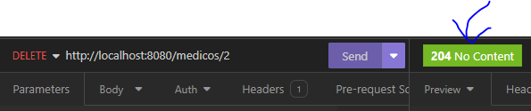
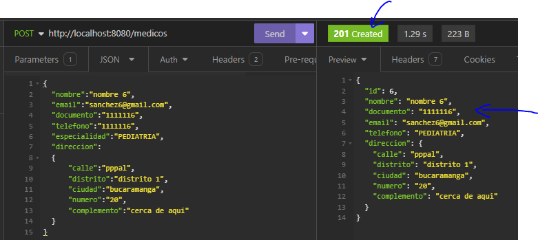
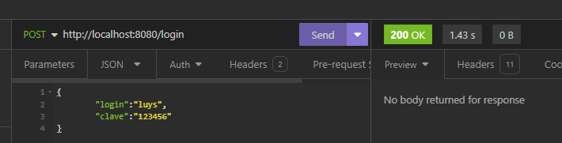
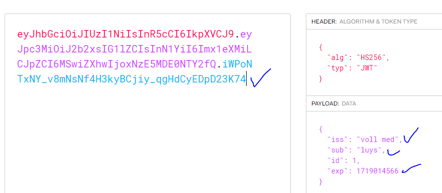

## Clinica
## Spring Boot 3
## Instructor: Diego Rojas
## Alura Latam

| Clase | Pasos                                                                                        | Errores/Observación                                                                            |
|-------|----------------------------------------------------------------------------------------------|------------------------------------------------------------------------------------------------|
| 01-01 | Creando proyecto con Spring Boot 3                                                           |                                                                                                |
|       | se ingresa a https://start.spring.io/                                                        |                                                                                                |
|       | se configura y se agregan 3 dependencias                                                     |                                                                                                |
|       | 1. Spring Boot Dev Tools<br/>2. Lombok <br/>3. Spring Web                                    |                                                                                                |
|       |                                                                                              |                                                                                                |
| 01-06 | Estructura proyecto                                                                          |                                                                         |
|       | se verifican las dependencias en maven                                                       |                                                                                                |
|       | se verifica la estructura del proyecto                                                       |                                                                     |
|       |                                                                                              |                                                                                                |
| 01-07 | Hello World                                                                                  |                                                                                                |
|       | se crea el paquete controller luego la clase HelloController                                 |                                                                                                |
|       | se le coloca la anotacion al controlador: @RestController                                    |                                                                                                |
|       | se agrega la anotacion en el controlador @RequestMapping("/hello")                           |                                                                     |
|       | se crea el metodo helloWorld(), con su @GetMapping                                           |                                                                                                |
|       |                                                                                              |                                                                                                |
| 02-02 | Enviando datos                                                                               |                                                                     |
|       | se debe descargar insomia, para pruebas de api                                               |                                                                                                |
|       | https://insomnia.rest/download                                                               |                                                                                                |
|       | se crea el nuevo http request                                                                |                                                                     |
|       | se verifica conexion con spring, y el endpoint                                               |                                                                     |
|       | se puede enviar un datos json y ver que da error pero si establece la conexión               |                                                                                                |
|       |                                                                                              |                                                                                                |
| 02-03 | Recibiendo datos                                                                             |                                                                                                |
|       | se crea MedicoController                                                                     |                                                                                                |
|       | se le coloca @RestController                                                                 |                                                                                                |
|       | se agrega el requestmapping  @RequestMapping("/medicos")                                     |                                                                                                |
|       | se crea el metodo registrarMedico, como recibe datos entonces se agrega su:                  |                                                                     |
|       | @PostMapping                                                                                 |                                                                                                |
|       | los datos que se envian son el @RequestBody                                                  |                                                                     |
|       |                                                                                              |                                                                                                |
| 02-05 | CORS                                                                                         |                                                                                                |
|       | se crea el paquete de configuration                                                          |                                                                                                |
|       | se agrega la clase corsconfiguration                                                         |                                                                                                |
|       | se agrega el codigo, CORS                                                                    |                                                                                                |
|       |                                                                                              |                                                                                                |
| 02-06 | DTO Java Record #1                                                                           |                                                                                                |
|       | se crea un record para mapear los parametros que se reciben de los datos del medico          |                                                                                                |
|       | en el nuevo paquete model, el tipo record DatosRegistroMedico                                |                                                                                                |
|       | se crea la clase enum especialidad, con 4 especialidades                                     |                                                                     |
|       | se crea la clase record datosDireccion,                                                      | muestra ok, solo envio datos, sin direccion                                                    |
|       |                                                                                              |                                                                                                |
| 02-07 | DTO Java Record #2                                                                           |                                                                     |
|       | se revisa el formato del dto y del json que se envia, todo ok                                |                                                                                                |
|       | revision de las validaciones                                                                 |                                                                   |
|       | https://docs.oracle.com/en/java/javase/16/language/records.html                              |                                                                                                |
|       |                                                                                              |                                                                                                |
| 03-03 | Agregando dependencias                                                                       |                                                                                                |
|       | - agregar dependencia con spring initializr  ojo seleccionar **maven**                       |                                                                   |
|       | - spring data jpa + mysql driver + flyway migration                                          |                                                                                                |
|       | - se va a explorer y se busca el codigo de la dependencia y se agrega al proyecto            |                                                                                                |
|       |                                                                                              |                                                                                                |
|       | luego es necesario configurar el application.properties                                      |                                                                                                |
|       | con:                                                                                         |                                                                                                |
|       | - spring.datasource.driver-class-name=com.mysql.cj.jdbc.Driver                               |                                                                                                |
|       | - spring.datasource.url=jdbc:mysql://host/bd_name                                            |                                                                                                |
|       | - spring.datasource.username=user_name                                                       |                                                                                                |
|       | - spring.datasource.password=pass_word                                                       |                                                                                                |
|       |                                                                                              |                                                                                                |
|       | voy a usar la bd de mysql de: https://www.freesqldatabase.com/                               |                                                                                                |
|       |                                                                                              |                                                                                                |
| 03-05 | Entidades JPA                                                                                |                                                                                                |
|       | se crea la clase Medico, para la persistencia de datos                                       |                                                                                                |
|       | se le agrega el @Table(name="medico")                                                        |                                                                                                |
|       | @Entity(name = "Medico"), @Id , @GeneratedValue(strategy = GenerationType.IDENTITY)          |                                                                                                |
|       | @Enumerated(EnumType.STRING) en especialidad                                                 |                                                                                                |
|       | @Embedded en direccion                                                                       |                                                                                                |
|       | y @Embeddable en Direccion                                                                   |                                                                                                |
|       |                                                                                              |                                                                                                |
|       | **lombok**  en Medico                                                                        |                                                                                                |
|       | con anotaciones puedo pedir que cree todo lo necesario como los setter y getters etc         |                                                                                                |
|       | @Getter,  @NoArgsConstructor, @AllArgsConstructor, @EqualsAndHashCode(of = "id")             |                                                                                                |
|       |                                                                                              |                                                                                                |
|       | luego para Direccion, con lombok:                                                            |                                                                                                |
|       | @Getter, @NoArgsConstructor, @AllArgsConstructor                                             |                                                                                                |
|       |                                                                                              |                                                                                                |
|       | vamos a medicocontroller.                                                                    |                                                                                                |
|       |                                                                                              |                                                                                                |
| 03-06 | Interfaces repository                                                                        |                                                                                                |
|       | se crean los repositorios, quien se encargará del CRUD                                       |                                                                                                |
|       | se crea la interface MedicoRepository                                                        |                                                                                                |
|       | que extiende de: extends JpaRepository,                                                      |                                                                                                |
|       | -> necesita 2 parametros                                                                     |                                                                                                |
|       | 1. tipo de objeto    Medico                                                                  |                                                                                                |
|       | 2. el id,  Long                                                                              |                                                                                                |
|       | luego en el medicoController se agrega el @autowired **no se recomienda para testing**       | da error en insomia:                                              |
|       | se crean los constructores para cada caso                                                    | dice que la tabla no existe. la tabla medicos                                                  |
|       | se debe tomar la decision del como crear la tabla medicos...                                 |                                                                   |
|       |                                                                                              |                                                                                                |
| 03-08 | Migraciones flyway #1                                                                        |                                                                                                |
|       | es necesario crear la tabla medicos.                                                         |                                                                                                |
|       | - usando flyway                                                                              |                                                                                                |
|       | - se crea el directorio **db+migration** en la carpeta resources, es requisito               |                                                                                                |
|       | - se crea el archivo .sql                                                                    |                                                                                                |
|       | - el nombre tiene 3 partes:                                                                  |                                                                                                |
|       | ---- 1. la version     __ con 2 underscore al final                                          |                                                                                                |
|       | ---- 2. el nombre explicito                                                                  |                                                                                                |
|       | ---- 3. la extension sql                                                                     |                                                                                                |
|       | ejemplo: v1__create-table-medicos.sql y se reconoce como mysql el icono                      |                                                                             |
|       | en ese archivo debe estar el codigo sql para crear la tabla                                  | da este error:                                                                                 |
|       | no puede hacer la migracion, hay un error                                                    | 1 SQL migrations were detected but not run because they did not follow the filename convention |
|       |                                                                                              |                                                                                                |
| 03-09 | Migraciones flyway #2                                                                        |                                                                                                |
|       | - el error es por el nombre, debe ser en mayusculas la V                                     |                                                                                                |
|       | V1__create-table-medicos.sql                                                                 |                                                                                                |
|       | me dan muchos errores, se revisa sin exto, se crea la tabla en phpmyadmin con el sql         |                                                                                                |
|       | se prueba con insomia, todo ok el dato ingresa                                               |                                                                         |
|       | da error el tamaño del documento se lleva a 10                                               |                                                                                                |
|       |                                                                                              |                                                                                                |
| 03-10 | Validación                                                                                   |                                                                                                |
|       | se agrega dependencia del paquete **validation** en https://start.spring.io/                 |                                                                         |
|       | en el archivo pom.xml                                                                        |                                                                                                |
|       | se debe validar en el DTO                                                                    |                                                                                                |
|       | se agregan las anotaciones para cada caso                                                    |                                                                                                |
|       | @NotNull   : no permite nulos                                                                |                                                                                                |
|       | @NotBalnk  : no permite vacio ni tampoco nulos                                               |                                                                                                |
|       | @Email     : valida que sea un email                                                         |                                                                                                |
|       | @Pattern   : experesion regular, por ejemplo solo numeros                                    |                                                                                                |
|       | - en DatosRegistroMedico y en DatosDireccion                                                 |                                                                                                |
|       | debo declarar las validaciones en el controlador  @Valid                                     |                                                                                                |
|       | ahora si se presenta un error estar pendiente del mensaje bad request                        |                                                                         |
|       | **reto** falto definir el telefono, y es necesario agregarlo. que hacer?                     |                                                                                                |
|       |                                                                                              |                                                                                                |
| 03-13 | Nueva migración                                                                              |                                                                                                |
|       | Es muy comun, es necesario agregar el telefono del medico.                                   |                                                                                                |
|       | 1. creo la migracion sql                                                                     |                                                                                                |
|       | 2. se actualiza la entidad Medico                                                            |                                                                                                |
|       | 3. se agrega el campo en DatosRegistroMedico con su validacion @NotBlank                     |                                                                                                |
|       |                                                                                              |                                                                                                |
| 04-02 | Produciendo datos                                                                            |                                                                                                |
|       | La idea es mostrar datos                                                                     |                                                                         |
|       | Consideraciones:                                                                             |                                                                         |
|       | se crea un nuevo metodo en el controller para enviar lista                                   |                                                                                                |
|       | con un @GettMapping                                                                          |                                                                                                |
|       | se crea en insomia un get /medicos para ver la lista de medicos                              |                                                                         |
|       | como se ve en la imagen retornan todos los datos, pero solo se quieren los siguientes datos: |                                                                                                |
|       | nombre, especialidad, documento y email.                                                     |                                                                                                |
|       |                                                                                              |                                                                                                |


### CORS
    @Configuration
    public class CorsConfiguration implements WebMvcConfigurer {
    
        @Override
        public void addCorsMappings(CorsRegistry registry) {
            registry.addMapping("/**")
                .allowedOrigins("http://localhost:3000")
                .allowedMethods("GET", "POST", "PUT", "DELETE", "OPTIONS", "HEAD", "TRACE", "CONNECT");
        }
    }

### Json enviado en pruebas con insomia:
    
    {
        "nombre":"luis",
        "email":"sanchez@gmail.com",
        "documento":"1114277",
        "especialidad":"ODONTOLOGIA",
        "direccion":
            {
            "calle":"pppal",
            "distrito":"distrito 1",
            "ciudad":"bucaramanga",
            "numero":"20",
            "complemento":"cerca de aqui"
            }
    }
    

### Dependencias agregadas: mysql + jpa + flyway migration

    <dependency>
      <groupId>org.springframework.boot</groupId>
      <artifactId>spring-boot-starter-data-jpa</artifactId>
    </dependency>

    <dependency>
      <groupId>org.flywaydb</groupId>
      <artifactId>flyway-core</artifactId>
    </dependency>

    <dependency>
      <groupId>org.flywaydb</groupId>
      <artifactId>flyway-mysql</artifactId>
    </dependency>

    <dependency>
      <groupId>com.mysql</groupId>
      <artifactId>mysql-connector-j</artifactId>
      <scope>runtime</scope>
    </dependency>

### Codigo SQL para crear la tabla medicos.

```sql
DROP TABLE IF EXISTS medicos;
CREATE TABLE medicos (
    id BIGINT NOT NULL AUTO_INCREMENT PRIMARY KEY,
    nombre VARCHAR(100) NOT NULL,
    email VARCHAR(100) NOT NULL UNIQUE,
    documento VARCHAR(10) NOT NULL UNIQUE,
    especialidad VARCHAR(100) NOT NULL,
    calle VARCHAR(100) NOT NULL,
    distrito VARCHAR(100) NOT NULL,
    complemento VARCHAR(100),
    numero VARCHAR(20),
    ciudad VARCHAR(100) NOT NULL
);
````

### Dependencia del paquete **validation**

    <dependency>
      <groupId>org.springframework.boot</groupId>
      <artifactId>spring-boot-starter-validation</artifactId>
    </dependency>

### Codigo para agregar el telofono en mysql

```sql
    ALTER TABLE medicos ADD telefono VARCHAR(20) NOT NULL;
````

### Nuevo Json ahora con el telefono

    {
        "nombre":"luis lolo",
        "email":"sanchez4@gmail.com",
        "documento":"11142155",
        "telefono":"123456",
        "especialidad":"PEDIATRIA",
        "direccion":
        {
            "calle":"pppal",
            "distrito":"distrito 1",
            "ciudad":"bucaramanga",
            "numero":"20",
            "complemento":"cerca de aqui"
        }
    }


