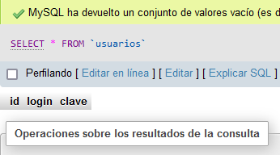
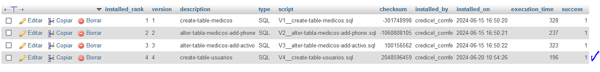

## APP Clinica
## Spring Boot 3 => spring-boot-3- aplique practicas proteja api rest
## Instructor: Diego Rojas
## Alura Latam

| Clase | Pasos                                                                    | Errores/Observación              |
|-------|--------------------------------------------------------------------------|----------------------------------|
|       | Iniciando rama para esta parte del curso                                 |                                  |
|       |                                                                          |                                  |
| 01-03 | Estandarizando retornos de API                                           |                                  |
|       | Es necesario enviar respuestas mas claras al cliente                     |                                  |
|       | con codigos personalizados ejem: 201 y no solo 200                       |                                  |
|       | en el metodo eliminarMedico() que es public void                         |                                  |
|       |                                                                          |                                  |
|       | **PARA DELETE**                                                          |                                  |
|       | se debe cambiar por ResponseEntity para que spring ayude a retornar      |                                  |
|       | el valor especifico, ahora obliga al metodo a responder                  | ahora tenemos esta respuesta:    |
|       | para este caso return ResponseEntity.noContent().build();                |           |
|       |                                                                          |                                  |
|       | **PARA UPDATE**                                                          |                                  |
|       | igual se agrega al metodo la respuesta ResponseEntity, pero tambien      | ahora da respuesta 200 ok + info |
|       | es necesario agregar un nuevo DTO que solo devuelva los datos necesarios |           |
|       |                                                                          |                                  |
|       |                                                                          |                                  |
|       | 200: operacion exitosa                                                   |                                  |
|       |                                                                          |                                  |

### Objetivos:

### Payload para actualizar un medico. en insomia, metodo PUT, actualizar solo el nombre

    {
			"id": 1,
			"nombre": "nombre 11"
    }

