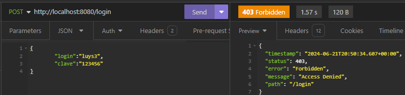

## Clinica
## Spring Boot 3
## Instructor: Diego Rojas
## Alura Latam

| Clase | Pasos                                                              | Errores/Observación     |
|-------|--------------------------------------------------------------------|-------------------------|
| 01-01 | Creando proyecto con Spring Boot 3                                 |                         |
|       | se ingresa a https://start.spring.io/                              |                         |
|       | se configura y se agregan 3 dependencias                           |                         |
|       | 1. Spring Boot Dev Tools 2. Lombok  3. Spring Web          |                         |
|       |                                                                    |                         |
| 01-06 | Estructura proyecto                                                |      |
|       | se verifican las dependencias en maven                             |                         |
|       | se verifica la estructura del proyecto                             |  |
|       |                                                                    |                         |
| 01-07 | Hello World                                                        |                         |
|       | se crea el paquete controller luego la clase HelloController       |                         |
|       | se le coloca la anotacion al controlador: @RestController          |                         |
|       | se agrega la anotacion en el controlador @RequestMapping("/hello") |  |
|       | se crea el metodo helloWorld(), con su @GetMapping                 |                         |
|       |                                                                    |                         |
| 02-02 | Enviando datos                                                     |  |
|       | se debe descargar insomia, para pruebas de api                     |                         |
|       | https://insomnia.rest/download                                     |                         |
|       | se crea el nuevo http request                                      |  |
|       | se verifica conexion con spring, y el endpoint                     |  |
|       |                                                                    |                         |

